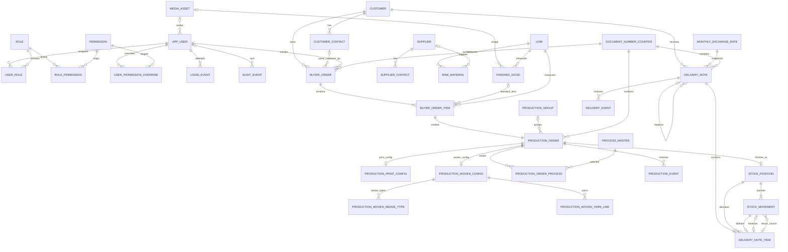
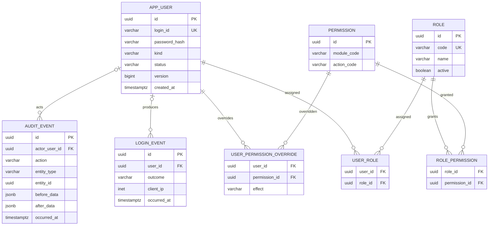
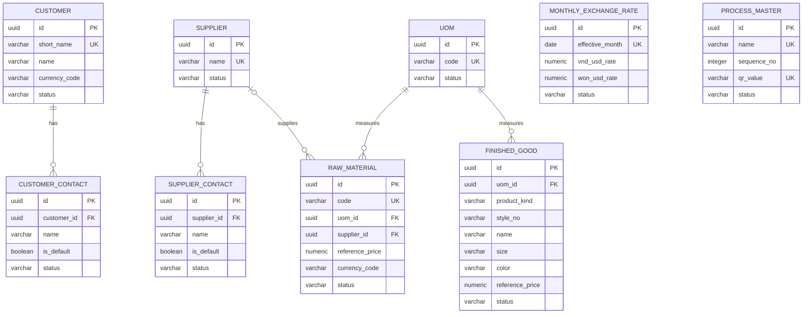
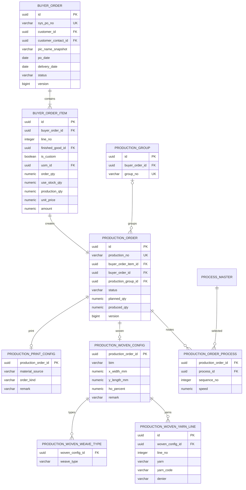
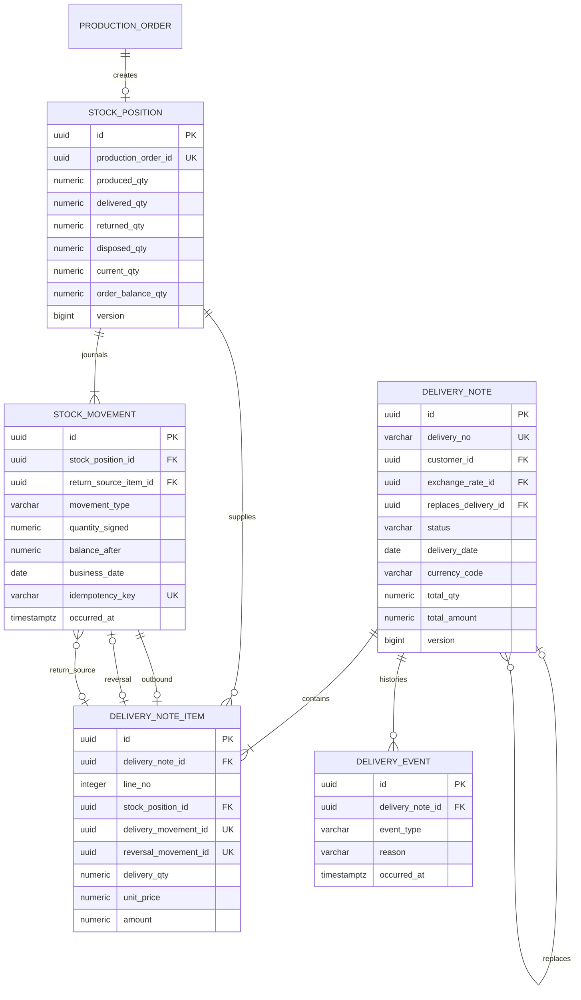

# ERD logic PostgreSQL ERP

## Tổng quan

ERD này là logical model đã áp dụng toàn bộ quyết định D1–D12. Chưa phải DDL. Chi tiết cột/type/constraint xem [erp-data-dictionary.md](erp-data-dictionary.md).

## ERD toàn hệ thống



Các quan hệ `DOCUMENT_NUMBER_COUNTER` trong sơ đồ là logical allocation relation, không nhất thiết là FK từ chứng từ tới counter row.

## Identity ERD



## Master Data ERD



## Sales và Production ERD



## Inventory và Delivery ERD



## Debit projection

```text
DebitProjectionRow
  = DeliveryNote(status = POSTED)
    JOIN DeliveryNoteItem

reference = delivery_no || '/' || line_no padded 2 digits
```

Output tối thiểu:

- reference;
- delivery ID/no/date;
- customer snapshot;
- Buyer PO/item snapshots;
- quantity, UOM, unit price, amount, currency.

Không có Debit table mutable hoặc Debit sequence phase đầu.

## Constraint xuyên bảng cần application transaction

Một số rule không thể diễn đạt bằng simple FK/check:

- Buyer Order PIC ownership dùng composite FK `(customer_contact_id, customer_id)`.
- Production Group cùng Buyer Order dùng composite FK; ít nhất hai members được deferred-validate trước commit.
- Config subtype phải khớp item product kind, cấm tồn tại đồng thời PRINT/WOVEN và đúng subtype bắt buộc trước Finish.
- Delivery items phải cùng Customer/Currency.
- Source chain dùng composite FK: Buyer Order Item ↔ Buyer Order, Production Order ↔ Buyer Order Item và Stock Position ↔ Production Order/Buyer Order Item.
- Delivery quantity không vượt locked physical/order capacity.
- Production Finish chỉ một lần.
- Reversal phải tạo movement chính xác một lần.
- Effective permission precedence.

Các rule này được enforce trong application service + row lock + unique/check constraints hỗ trợ, và integration tests.